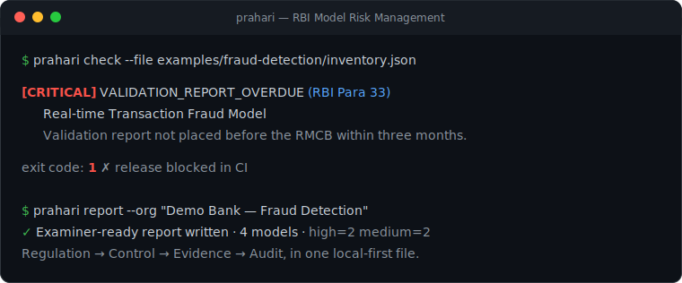
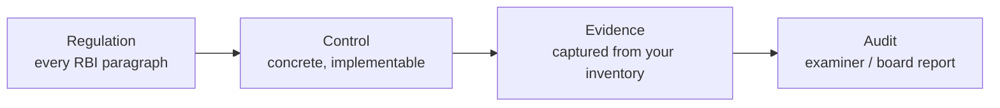
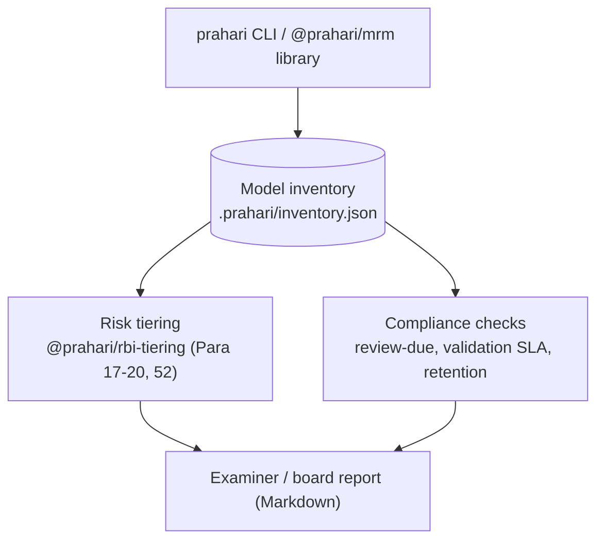

<div align="center">

# Prahari

**Open-source model-risk governance for regulated AI — starting with the RBI Draft Guidance (2026).**

[](https://www.npmjs.com/package/@prahari/mrm)
[](https://www.npmjs.com/package/@prahari/rbi-tiering)
[](LICENSE)

[Control reference](reference/controls) · [Crosswalk](reference/crosswalk) · [Control mapping](reference/rbi-mrm-2026-control-mapping.md) · [Toolkit](packages/mrm) · [Tiering engine](packages/rbi-tiering) · [Examples](examples) · [Disclaimer](DISCLAIMER.md)

<br/>



</div>

> ⚠️ **Not legal advice. Not an RBI publication. No guarantee of compliance.** Prahari helps you operationalize *your* Model Risk Management Framework; your organization remains accountable for its models (RBI Para 8). Read [DISCLAIMER.md](DISCLAIMER.md).

---

## What you get

- **A control reference you can cite.** [24 pages](reference/controls) mapping the RBI guidance **paragraph by paragraph** — verbatim text → intent → expected controls → evidence → example → common mistakes. Covers **Para 1–63 end to end**, so you cite a specific interpretation (*Prahari Control Reference — Para 54*) instead of "some README".
- **A local-first toolkit.** The `prahari` CLI + libraries give you a **model inventory**, automatic **non-offsetting risk tiering** (Para 17–20, 52), **compliance checks**, and an **examiner-ready report** — from a single JSON file. No server, no cloud; your model data never leaves your environment.
- **A CI gate.** `prahari check` **exits non-zero** on a critical finding (e.g. a high-tier model whose validation report is overdue, Para 33), so non-compliance can block a pipeline — see the [fraud-detection example](examples/fraud-detection).
- **Evidence an examiner can read.** Every control cites its RBI paragraph; every report states that **your organization** — not the tool, not a vendor — remains accountable (Para 8).
- **A multi-framework crosswalk.** The same control core mapped to **NIST AI RMF** (ISO 42001 / EU AI Act / SR 11-7 next), with the **deltas** each framework adds called out — see [reference/crosswalk](reference/crosswalk).

**New here?** → [Quick start](#quick-start) · [Examples](examples) · [Control reference](reference/controls)

## Why

AI-governance frameworks increasingly describe *what* an organization should do, but rarely show *how* to implement it. The hard part of model-risk compliance is not storing a list of models — plenty of tools do that. It is **connecting a regulation to a concrete control, the evidence that proves it, and an audit trail an examiner can read.**

Prahari is two complementary artifacts:

1. a **human-readable control reference** that maps a regulation, paragraph by paragraph, to concrete operational controls; and
2. an **open-source toolkit** that implements those controls and produces auditable evidence.

It starts with the **RBI Draft Guidance on Model Risk Management (2026)**, and is built so the same control core can later map to other frameworks (NIST AI RMF, ISO 42001, EU AI Act, SR 11-7, MAS FEAT).

> **Why open source?** Because regulatory controls should be **inspectable**. A bank, an auditor, and a regulator should all be able to read exactly how a requirement becomes a control.

## The thesis, in four words



## How the toolkit works (today)

Local-first and self-hostable: your model data is a JSON file that never leaves your environment. No server, no cloud.



## Who is this for

Banks · NBFCs · Urban/Rural Co-operative Banks · AIFIs · ARCs · CICs · model-risk officers · model validators · internal auditors · AI/model-governance teams · RegTech vendors · researchers.

## How it compares

| Capability | Prahari | Typical GRC suite | Spreadsheet |
| --- | :---: | :---: | :---: |
| Paragraph-level control mapping | ✅ | partial | ❌ |
| Open source / inspectable | ✅ | ❌ | n/a |
| Self-hosted (data stays with you) | ✅ | depends | ✅ |
| Non-offsetting risk tiering (Para 20) | ✅ | varies | ❌ |
| Evidence + examiner report generation | ✅ | partial | ❌ |
| Cost | free | $$$ | free |

## Quick start

```bash
npm install
npm run build
node packages/mrm/dist/cli.js init
node packages/mrm/dist/cli.js add --name "Loan Pricing Sheet" --type spreadsheet \
  --use "Derive lending rate" --owner eve --developer frank --validator grace --approver heidi \
  --materiality 3 --complexity 1 --active
node packages/mrm/dist/cli.js report --org "Acme Bank"
```

See [examples/](examples) for ready-made inventories and the reports they produce.

## What's here

| Package | What it does |
| --- | --- |
| **[@prahari/mrm](packages/mrm)** | Toolkit + `prahari` CLI: inventory, auto risk-tiering, compliance checks, examiner-ready report. |
| **[@prahari/rbi-tiering](packages/rbi-tiering)** | Pure tiering engine: composite non-offsetting tier (Para 17–20, 52), tier→controls (Para 18), review cadence (Para 17), 10-year retention (Para 23), validation SLA (Para 33). |

## Control reference

The [control reference](reference/controls) covers the RBI guidance **end to end (Para 1–63), in 24 pages**, each following the same shape — **verbatim text → intent → expected controls → evidence → example → common mistakes** — so every page is citeable on its own (e.g. *Prahari Control Reference — Para 60*). The condensed clause-by-clause table is the [control mapping](reference/rbi-mrm-2026-control-mapping.md).

## Roadmap

**Shipped**
- ✅ Per-paragraph control reference — full **Para 1–63** coverage (24 pages).
- ✅ `examples/` across institution types — retail bank, NBFC, GenAI, credit scoring, fraud detection.
- ✅ **Multi-framework crosswalk** — a shared control core mapped to **NIST AI RMF · ISO/IEC 42001 · SR 11-7 · EU AI Act · MAS FEAT**, coverage/deltas derived (see [reference/crosswalk](reference/crosswalk)).
- ✅ Toolkit: CSV bulk-`import` and `update` (re-tiers on change).
- ✅ CI (build · test · typecheck · crosswalk drift · link check).

**Next**
- Toolkit: HTML/PDF report export; optional API.
- Refine every mapping against the final RBI notification and each framework's source text.

## Principles

- **Local-first & self-hostable.** Your model data never leaves your environment.
- **The RE stays accountable.** Prahari produces evidence and checks; it never claims your compliance for you (Para 8).
- **Faithful to the text.** Every control cites its RBI paragraph.

## License

[Apache-2.0](LICENSE). See [NOTICE](NOTICE) and [DISCLAIMER.md](DISCLAIMER.md).
